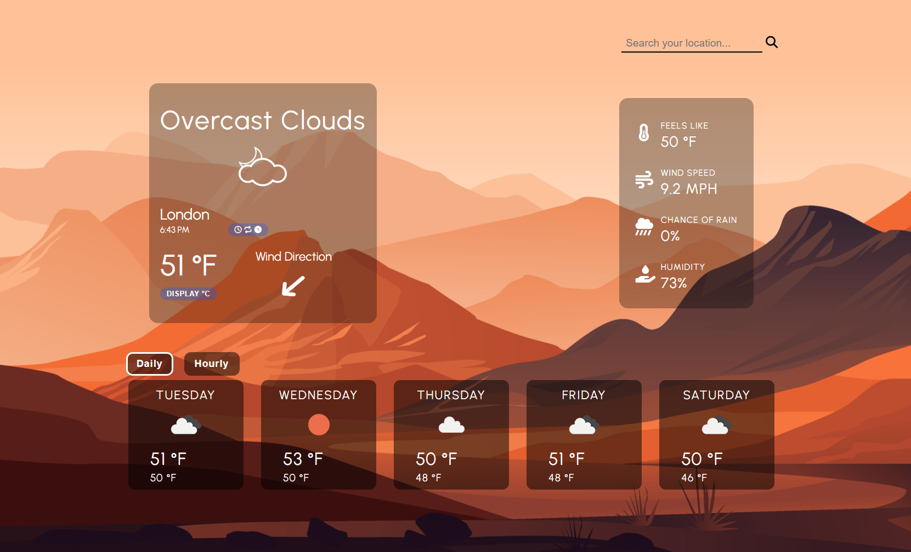

# 🌦️ Weather App

**Weather App** is a simple yet dynamic weather forecast application that delivers real-time weather data for any city in the world. Users get both daily and hourly forecasts, transforming raw data from the [OpenWeatherMap API](https://openweathermap.org/api) into clear, actionable insights — all through a clean and interactive interface.

Built with HTML, CSS, and vanilla JavaScript, bundled with **Webpack** for optimised production builds.

